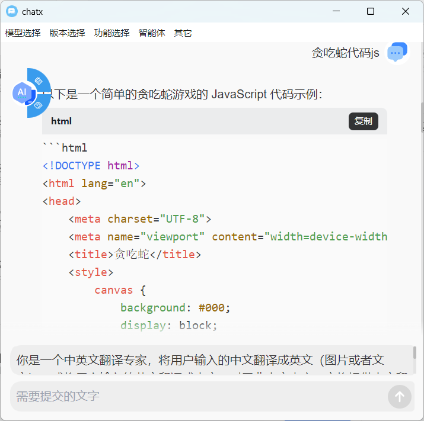

# ChatX



ChatX 是一款功能强大的跨平台应用程序，支持 Windows 和 Ubuntu 系统。它集成了多种大模型功能，如 ChatGPT、ChatGLM 和 DeepSeek 等，旨在为用户提供高效、智能的文本处理和翻译服务。

## 主要功能

### 1. 复制翻译


- 支持一键复制文本并自动翻译。
- 支持多语言翻译，满足不同用户的需求。

### 2. 分段组合
- 支持将长文本分段处理，便于逐段翻译或编辑。
- 提供分段组合功能，方便用户将多段文本合并为一个整体。

### 3. 大模型支持
- 集成 ChatGPT、ChatGLM 和 DeepSeek 等大模型，提供智能对话和文本生成功能。
- 支持多种模型切换，用户可以根据需求选择不同的模型进行交互。

### 4. 跨平台支持
- 支持 Windows 和 Ubuntu 系统，确保用户在不同操作系统上都能流畅使用。

### 4. 插件支持
- 支持通过配置文件（~/.chatx/config.json）配置自定义翻译插件。

## 使用场景
- **翻译工作**：快速翻译长篇文章或文档，支持分段翻译和组合。
- **文本编辑**：通过分段组合功能，轻松编辑和整理文本内容。
- **智能对话**：利用大模型功能进行智能对话，获取实时反馈和建议。
- **文字优化**：提升文本质量，适用于写作、报告和邮件等场景。

## 系统要求
- **Windows**：Windows 10 或更高版本。
- **Ubuntu**：Ubuntu 18.04 或更高版本。

## 下载与安装
- 用户可以从官方网站下载适用于 Windows 和 Ubuntu 的安装包，按照提示进行安装即可。

## 未来更新
- 计划增加更多大模型支持，进一步提升智能交互体验。
- 优化用户界面，提供更加友好的操作体验。

ChatX 致力于为用户提供高效、智能的文本处理工具，无论是翻译、编辑还是智能对话，都能满足您的需求。

## 启动 / 编译
```shell
nvm use 23
# 安装环境
npm install
# 启动electron
npm run electron-start
# 打包
npm run package
# or
npm run make
```

## 配置文件

> ~/.chatx/config.json
