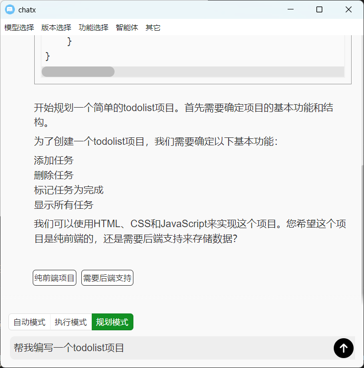
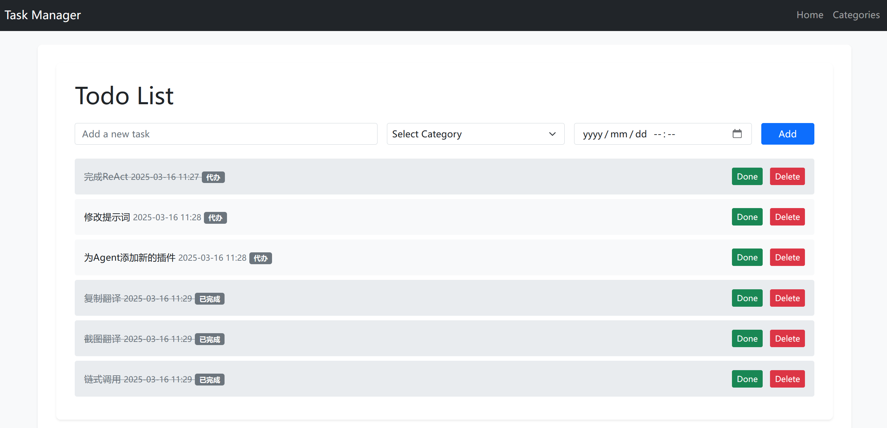
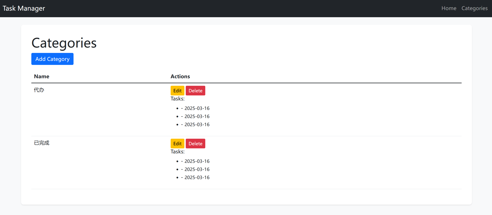
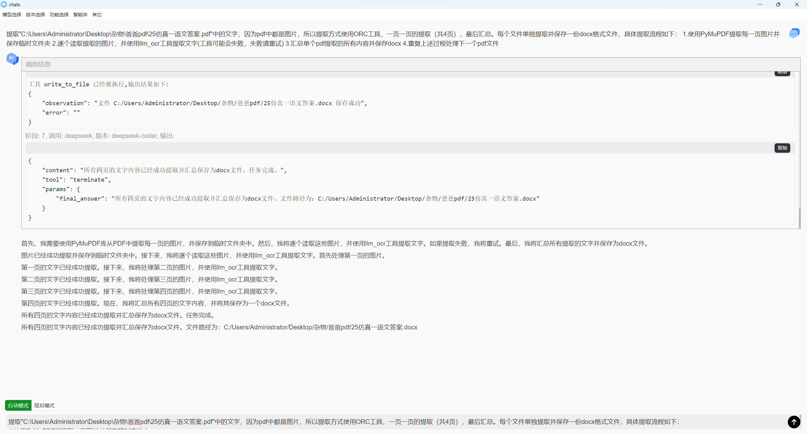

# ChatX



ChatX 是一款功能强大的跨平台翻译应用程序，支持 Windows 和 Ubuntu 系统。它拥有多种可选的翻译方式，例如百度翻译、谷歌翻译，并且支持用户自定义功能。本软件也集成大模型功能，提供了大模型翻译的选项。更为关键的是，本软件集成了 Agent 功能，通过 ReAct 能够帮助使用人员完成指定的任务。于此同时，链式调用功能也被集成，用于可定制化的需求，例如多模型协同调用、思维链拼接等。

## 特色功能

### 复制翻译


- 为了简化翻译方式，我们提供了复制翻译功能，即当用户复制文字时，会自动弹出悬浮窗口，里面提供了传统翻译和大模型翻译等选项。

### 分段组合

- 在阅读文献时，当一句话被拆分为两部分时，便会导致无法一次性复制完整。因此，我们加入了分段组合功能，即当用户复制后，悬浮按钮中会提供组合选项，当用户再次复制下一段乃只多段文字时，前后分段记录中的文字会按空格自动拼接。

### 大模型支持

- 为了进一步提供精确的翻译结果，我们集成 ChatGPT、ChatGLM 和 DeepSeek 等大模型功能，支持用户自定义翻译系统提示词，并且支持自定义配置更多的大模型。

### 截图翻译

- 在阅读英文论文时，时常会遇到公式文字混杂的情况，这也导致传统翻译功能失效或者混乱的结果，因此，我们集成了截图功能，在快捷悬浮窗口中选择截图，用户可以选择特定的区域，最后结果将由大模型进行回答。

### 链式调用

- 现在 deepseek 拥有很好的思维链，将其和其它模型进行结合甚至能够超越其原有模型的能力，因此，我们集成了链式调用功能，即可以自定义的将模型或者用户插件的结果按照前后或者并行的顺序进行组合。

### Agent

- 我们进一步集成了 ReAct，这使得我们的软件拥有了 Cline 和 OpenManus 的能力，帮助用户自动完成文件分析，代码修改，网络搜索等等，这能够让我们的软件拥有自动化翻译文件的功能。
- 如下是 Agent 自动编写，大模型使用 deepseek-coder，并按照用户提供的报错信息完成的 ToDoList 项目，其代办事项使用 sqlite 实现了持久化：




- 下面是 Agent 实现 PDF 文件文字自动化提取，通过调用视觉大模型来实现 OCR。



## 系统要求

- **Windows**：Windows 10 或更高版本。
- **Ubuntu**：Ubuntu 18.04 或更高版本。

---

## 启动 / 编译

```shell
nvm use 23
# 安装环境
npm install
# 启动electron
npm run electron-start
# 打包
npm run package
# or
npm run make
```

_- 由于版本快速迭代，建议自己编译以体验最新功能. -_

## 若安装失败请手动复制配置文件(resource/config.json)到如下地址:

- linux: /home/[用户]/.chatx/config.json
- windown: C:\Users\\[用户]\\.chatx\config.json

## 安装完成后需进行以下操作

> 安装插件依赖

[插件页面: resource/plugins](resource/plugins)

> 配置大模型示例 (`添加ollama支持`)

config.json

```json
"models": {
  "ollama": {
    "api_url": "http://localhost:11434/api/chat",
    "versions": [
      "llama3.2",
      {
        "version": "gemma3:12b",
        "vision": [
          "image"
        ],
        "ollama": true
      }
    ]
  },
  "deepseek": {
    "api_url": "https://api.deepseek.com/chat/completions",
    "api_key": "你的key",
    "versions": [
      "deepseek-coder",
      "deepseek-chat",
      "deepseek-reasoner"
    ]
  },
  "chatglm": {
    "api_url": "https://open.bigmodel.cn/api/paas/v4/chat/completions",
    "api_key": "你的key",
    "versions": [
      "glm-4-flash",
      "glm-4-long",
      {
        "version": "glm-4v-flash",
        "vision": [
          "image"
        ]
      }
    ]
  },
}
```

> 配置大模型请求参数示例

config.json

```json
"llm_parmas": {
  "max_tokens": 4000,
  "temperature": 1.5,
  "stream": true
}
```

> 配置信息框模版示例

config.json

````json
"info_template": "阶段: {step}, 调用: {model}, 版本: {version}, 输出: \n\n```\n{output_format}\n```\n\n",
````

_- 可用配置字段如下: -_

- step: 当前阶段号
- model: 当前使用模型(model/plugins)
- version: 当前使用模型版本
- query: 初始输入
- input: 当前阶段格式化输入
- img_url: 初始图片 base64 输入
- output: 当前阶段原始输出
- outputs: 历史原始输出
- output_format: 当前阶段格式化输出
- output_formats: 历史格式化输出
- prompt: 初始系统提示词
- prompt_format: 当前阶段格式化系统提示词
- llm_parmas: 大模型请求参数
- api_url: 大模型请求 URL
- api_key: 大模型请求 KEY

_- 格式化：细节见链式调用 -_

> 配置记忆长度示例

config.json

```json
"memory_length": 10
```

> 配置失败重试次数示例

config.json

```json
"retry_time": 10
```

> 配置悬浮框快捷键显示时长示例

config.json

```json
"icon_time": 5
```

> 配置悬浮框快捷键示例

config.json

```json
"short_cut": "CommandOrControl+Shift+Space"
```

> 配置功能默认状态示例

config.json

```json
"func_status": {
  "clip": true,
  "react": true,
  "markdown": false,
  "math": false,
  "text": false
}
```

> 配置默认项示例

config.json

```json
"default": {
  "model": "gptgod",
  "version": "gpt-4o-mini",
  "plugin": "百度翻译[新]"
}
```

> 配置链式调用示例

参数周期:

* input_*: 使用调用模型前`可配置字段值`进行格式化
* ouput_*: 使用调用模型后`可配置字段值`进行格式化

config.json

- 基础对话

```json
"chain_call": [
  {
    "end": true
  }
]
```

- 基础对话+图片识别

```json
"chain_call": [
  {
    "input_template": "{img_url?'请识别图像内容后回答。':''}{input}",
    "end": true
  }
]
```

- 强制思维链

```json
"chain_call": [
  {
    "prompt_template": "{prompt}\nA conversation between User and Assistant.\nThe user asks a question, and the Assistant solves it.\nThe assistant first thinks about the reasoning process in the mind and then provides the user with the answer.\nThe assistant should engage in a lengthy period of contemplation before answering a question, while also reflecting on whether there are any errors in their thought process. \nDuring the thinking process, the assistant should propose multiple solutions and provide an extended chain of thought for each one.\nThe thought process for each solution should be very detailed, including the specific steps for implementation.\nThe reasoning process is enclosed within <think> </think> and <answer> </answer> tags, respectively, i.e:\n<think>\n reasoning process here \n</think>\n<answer>\n answer here \n</answer>",
    "input_template": "{input}",
    "end": true
  }
]
```

- 思维链拼接

```json
"chain_call": [
  {
    "model": "together",
    "version": "deepseek-ai/DeepSeek-R1-Distill-Llama-70B-free",
    "prompt": "请思考后回答"
  },
  {
    "model": "plugins",
    "version": "提取思维链",
    "input_data": {
      "input": "{input}"
    },
    "output_template": "<think>{output}</think>\n- query:{query}\n- answer:"
  },
  {
    "end": true
  }
]
```

- 文件对话

```json
"chain_call": [
  {
    "model": "plugins",
    "version": "文件读取",
    "input_data": {
      "file_path": "{file_path}"
    }
  },
  {
    "input_template": "如下是pdf中的文字内容:\n\n<pdf>{output_formats[0]}</pdf>\n\n如下是user输入内容:\n\n<user>{query}</user>\n\n请根据pdf中内容回答user输入。回复要求如下：\n- 过滤多余的文字，例如行号、页码和水印等。 \n- 尽可能多的思考细节、潜在相关和可能相关的内容。 \n- 对于原文中没有的内容，不需要猜测，提出观点和输出和原文可能产生不一致的内容。\n- 按照规范的格式输出。",
    "end": true
  }
]
```

_- 可配置字段 -_

该配置参数默认为原始字段属性值(见配置信息框模版)

特有字段：

- input_template: 当前阶段输入格式化模版
- output_template: 当前阶段输出格式化模版
- prompt_template: 系统提示格式化模版
- end: 链式调用结束标志

_- 可配置显示组件 -_

- system-prompt: 系统提示输入框
  - 对应可用字段为:
    - prompt: 初始系统提示词
- file-reader: 文件读取按钮
  - 对应可用字段为:
    - file-reader: 读取文件的路径

_- 更多案例见： -_

[resource/chain_calls](resource/chain_calls)

## 具体咨询请联系：

qq: 1084337496
邮箱: 1084337496@qq.com
